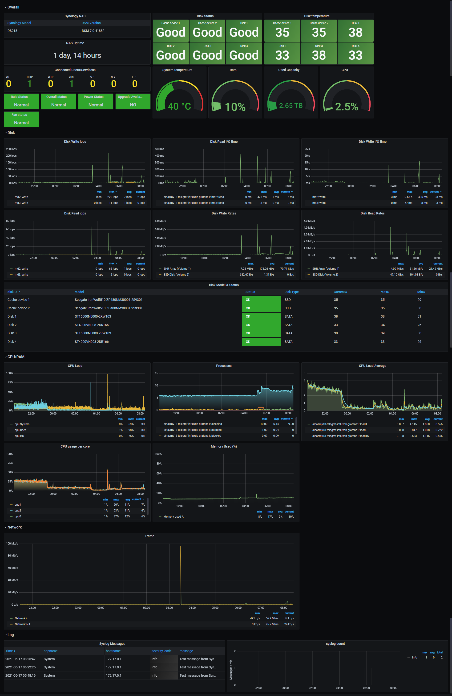

# synology-telegraf

If you want an all in one solution see [alhazmy13/Synology-NAS-monitoring](https://github.com/alhazmy13/Synology-NAS-monitoring)

 

## Features
* Support using an external InfluxDB and Grafana
* Run telegraf in docker locally on Synology
* Include Synology MIBS in container image

## Pre-Requistes
* InfluxDB setup and running
* Grafana setup and running
## Enable SNMP
1. From Control panel in your Synology NAS go to Terminal & SNMP
2. Click on SNMP tab, enable SNMP, and set your options

## Prep telegraf.conf
1. Download [telegraf.conf](etc/telegraf/telegraf.conf)
2. Edit the outputs, either influxdb or influxdb_v2
3. Copy `telegraf.conf` to your Synology somewhere

## Run Docker image in your Synology
1. Install Docker from Synology package center
3. Open Docker client from Synology > Image > Add > Add from url and paste Hub page url "https://hub.docker.com/r/gibby/synology-telegraf"
4. Wait until it finishes downloading the image
5. Click on the image and then click on Launch
6. Network Tab keep it in bridge mode 
7. Check "Enable auto-restart."
8. In Volume settings, click Add file and select the `telegraf.conf` file, on mount Path, paste ***/etc/telegraf/telegraf.conf*** and `check Read-Only`
9. Apply, Next, Done and your container should be ready.

## Add Dashboard in Grafana (only do 1)
* Import [Synology-Dashboard.json](Synology-Dashboard.json)
* Import Dashboard and chose 14590

## Thanks
https://github.com/alhazmy13/Synology-NAS-monitoring